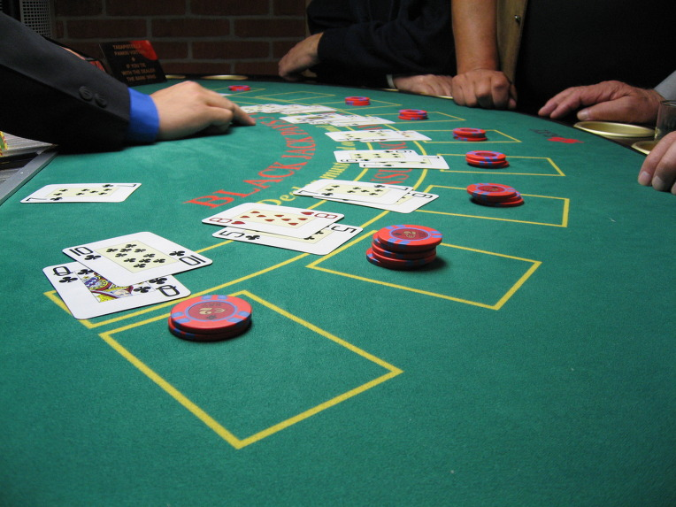

# BLACK JACK 
## with Test Driven Development (feat.oop)

### 규칙
- 카드의 숫자 계산은 숫자에 써있는 그대로. 
- 카드의 합이 **21점** 또는 21점에 가장 가까운 사람이 이기는 게임
- K,Q,J는 모두 10점
- 에이스는 1점 혹은 11점 중 유리한 숫자로 계산할 수 있음
- 카드는 조커를 제외한 52장이다. (즉, 카드는 다이아몬드,하트,스페이드,클럽 무늬를 가진 A,2~10,K,Q,J 으로 이루어져있다.)
- 처음 카드 2장이 주어짐. (처음 2장의 카드가 에이스와 10(J,Q,K 포함)으로 합이 21점이 되면 '블랙잭')
- 블랙잭인 경우 배팅액의 2배 획득
- 배탱액 : 배당율은 건 금액 만큼 버는 것이 기본. (플레이어가 두명인 경우 100원을 걸어서 이기면 200원, 지면 100원을 잃음)
- 게이머는 얼마든지 카드를 추가로 뽑을 수 있다.
- 딜러는 2카드의 합계 점수가 16점 이하이면 반드시 1장을 추가로 뽑고, 17점 이상이면 추가할 수 없다.
- 양쪽다 추가 뽑기 없이, 카드를 오픈하면 딜러와 게이머 중 소유한 카드의 합이 21에 가장 가까운 쪽이 승리한다.
- 단 21을 초과하면 초과한 쪽이 진다.

### TDD 기본 요구사항

1. 한 메서드에 오직 한 단계의 들여쓰기(indent)만 한다.
1. else 예약어를 쓰지 않는다.
1. 모든 원시값과 문자열을 포장한다.
1. 모든 엔티티를 작게 유지한다.
1. 2개 이상의 인스턴스 변수를 가진 클래스를 쓰지 않는다.
1. 일급 콜렉션을 쓴다.
1. 한 줄에 점을 하나만 찍는다.
1. 줄여쓰지 않는다(축약 금지).
1. 게터/세터/프로퍼티를 쓰지 않는다.

